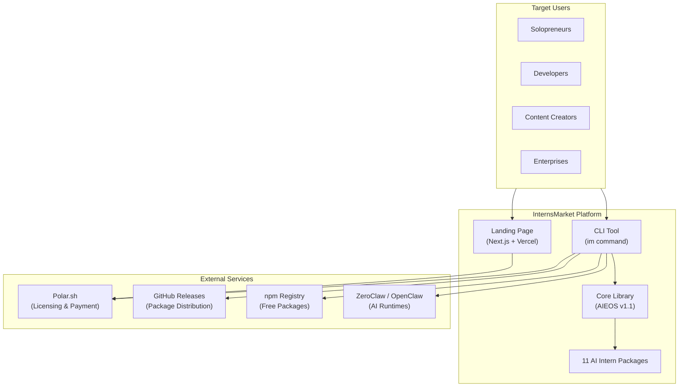
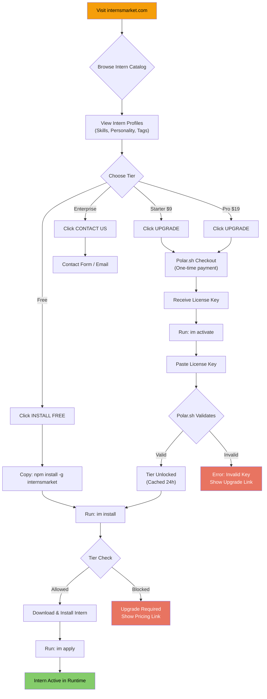
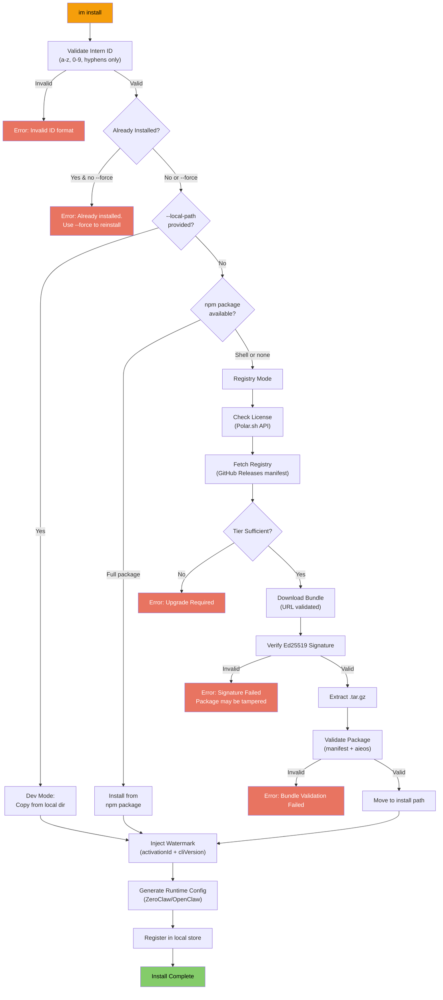
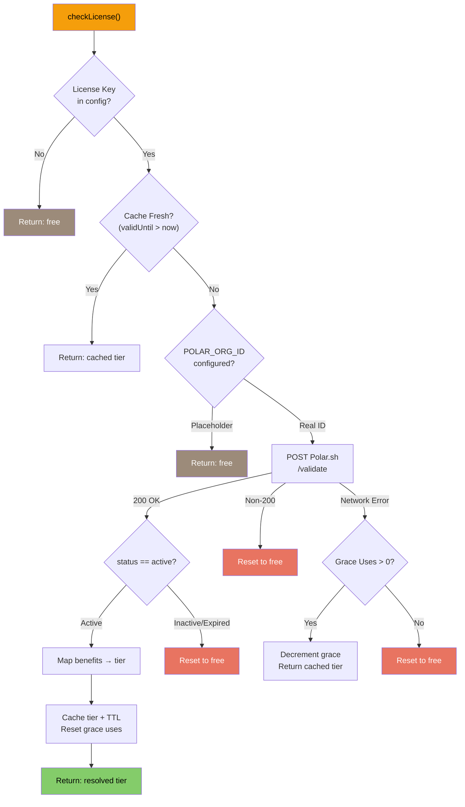
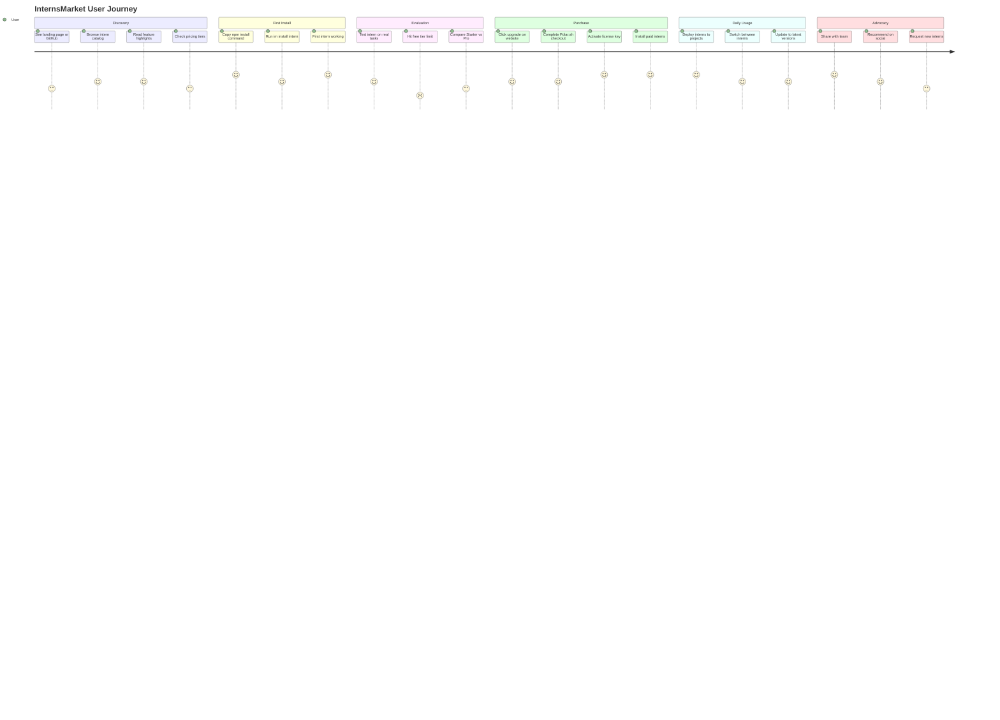
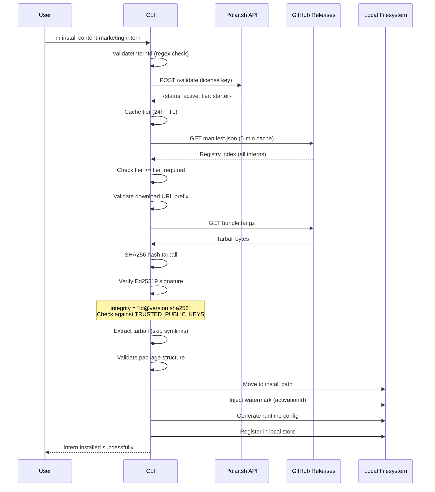
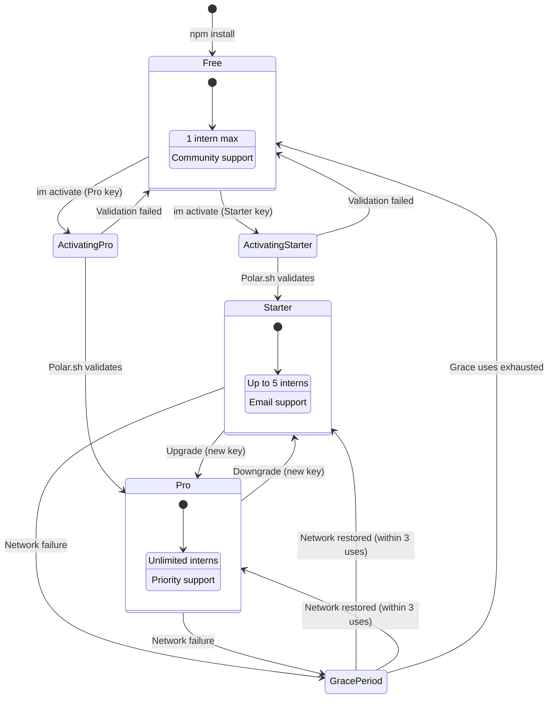
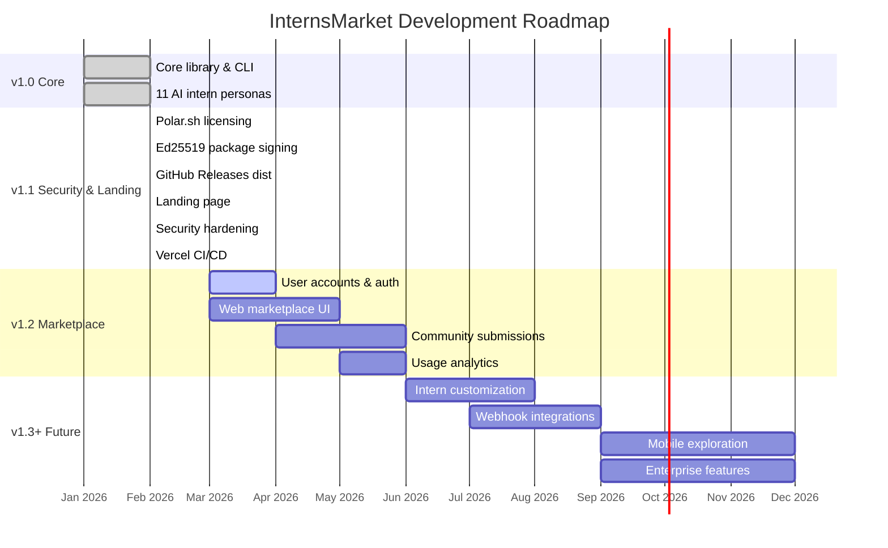

# InternsMarket — PRD User Flows & Journeys

## 1. Product Architecture Overview

---

## 2. User Discovery & Purchase Flow

---

## 3. CLI Install Flow (Technical)

---

## 4. License Validation Flow

---

## 5. User Journey Map

---

## 6. Security Verification Flow

---

## 7. Pricing Tier State Machine

---

## 8. Product Roadmap Timeline

